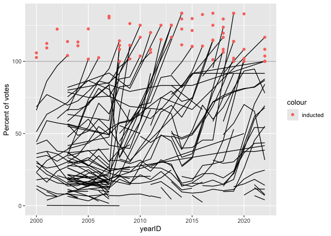

progress-report-jacobdoh51
================

# Lab report \#4 - instructions

------------------------------------------------------------------------

Follow the instructions posted at
<https://ds202-at-isu.github.io/labs.html> for the lab assignment. The
work is meant to be finished during the lab time, but you have time
until Monday (after Thanksgiving) to polish things.

All submissions to the github repo will be automatically uploaded for
grading once the due date is passed. Submit a link to your repository on
Canvas (only one submission per team) to signal to the instructors that
you are done with your submission.

``` r
# Load packages
library(rvest)
library(dplyr)
```

    ## 
    ## Attaching package: 'dplyr'

    ## The following objects are masked from 'package:stats':
    ## 
    ##     filter, lag

    ## The following objects are masked from 'package:base':
    ## 
    ##     intersect, setdiff, setequal, union

``` r
library(stringr)
library(readr)
```

    ## 
    ## Attaching package: 'readr'

    ## The following object is masked from 'package:rvest':
    ## 
    ##     guess_encoding

``` r
library(Lahman)
library(tidyverse)
```

    ## ── Attaching core tidyverse packages ──────────────────────── tidyverse 2.0.0 ──
    ## ✔ forcats   1.0.1     ✔ purrr     1.2.2
    ## ✔ ggplot2   4.0.3     ✔ tibble    3.3.1
    ## ✔ lubridate 1.9.5     ✔ tidyr     1.3.2

    ## ── Conflicts ────────────────────────────────────────── tidyverse_conflicts() ──
    ## ✖ dplyr::filter()         masks stats::filter()
    ## ✖ readr::guess_encoding() masks rvest::guess_encoding()
    ## ✖ dplyr::lag()            masks stats::lag()
    ## ℹ Use the conflicted package (<http://conflicted.r-lib.org/>) to force all conflicts to become errors

## Lab 4: Scraping (into) the Hall of Fame

------------------------------------------------------------------------

<!-- -->

## Individual Report Process

------------------------------------------------------------------------

``` r
# Baseball Reference Hall of Fame 2026 page (from lab 4 instruction)
url <- "https://www.baseball-reference.com/awards/hof_2026.shtml"
html <- read_html(url)
tables <- html_table(html)
head(tables[[1]], 3)
```

    ## # A tibble: 3 × 39
    ##   ``    ``           ``    ``    ``    ``    ``    ``    ``    ``    ``    ``   
    ##   <chr> <chr>        <chr> <chr> <chr> <chr> <chr> <chr> <chr> <chr> <chr> <chr>
    ## 1 Rk    Name         YoB   Votes %vote HOFm  HOFs  Yrs   WAR   WAR7  JAWS  Jpos 
    ## 2 1     Carlos Belt… 4th   358   84.2% 126   50    20    70.0  44.4  57.2  58.0 
    ## 3 2     Andruw Jones 9th   333   78.4% 109   32    17    62.7  46.4  54.6  58.0 
    ## # ℹ 27 more variables: `Batting Stats` <chr>, `Batting Stats` <chr>,
    ## #   `Batting Stats` <chr>, `Batting Stats` <chr>, `Batting Stats` <chr>,
    ## #   `Batting Stats` <chr>, `Batting Stats` <chr>, `Batting Stats` <chr>,
    ## #   `Batting Stats` <chr>, `Batting Stats` <chr>, `Batting Stats` <chr>,
    ## #   `Batting Stats` <chr>, `Batting Stats` <chr>, `Pitching Stats` <chr>,
    ## #   `Pitching Stats` <chr>, `Pitching Stats` <chr>, `Pitching Stats` <chr>,
    ## #   `Pitching Stats` <chr>, `Pitching Stats` <chr>, `Pitching Stats` <chr>, …

``` r
# Hall of Fame voting table (from lab 4 instruction)
data <- tables[[1]]
actual_col_names <- data[1, ]
colnames(data) <- actual_col_names
data <- data[-1, ]
head(data, 3)
```

    ## # A tibble: 3 × 39
    ##   Rk    Name       YoB   Votes `%vote` HOFm  HOFs  Yrs   WAR   WAR7  JAWS  Jpos 
    ##   <chr> <chr>      <chr> <chr> <chr>   <chr> <chr> <chr> <chr> <chr> <chr> <chr>
    ## 1 1     Carlos Be… 4th   358   84.2%   126   50    20    70.0  44.4  57.2  58.0 
    ## 2 2     Andruw Jo… 9th   333   78.4%   109   32    17    62.7  46.4  54.6  58.0 
    ## 3 3     Chase Utl… 3rd   251   59.1%   94    36    16    64.6  49.3  56.9  56.6 
    ## # ℹ 27 more variables: G <chr>, AB <chr>, R <chr>, H <chr>, HR <chr>,
    ## #   RBI <chr>, SB <chr>, BB <chr>, BA <chr>, OBP <chr>, SLG <chr>, OPS <chr>,
    ## #   `OPS+` <chr>, W <chr>, L <chr>, ERA <chr>, `ERA+` <chr>, WHIP <chr>,
    ## #   G <chr>, GS <chr>, SV <chr>, IP <chr>, H <chr>, HR <chr>, BB <chr>,
    ## #   SO <chr>, `Pos Summary` <chr>

``` r
# Checking variable types (from lab 4 instruction)
data$Votes <- as.numeric(data$Votes)
data$percent_vote <- readr::parse_number(data$`%vote`)

# Clean data (Data cleaning process)
hall_fame_clean <- data %>%
  select(name = 2, votes = 4, percent = 5) %>%
  mutate(name = str_remove(as.character(name), "^X-"), votes = as.numeric(votes), percent = parse_number(as.character(percent)), 
         year = 2026, inducted = ifelse(percent >= 75, "Yes", "No")) %>%
  filter(!is.na(name), !is.na(votes), !is.na(percent)) %>%
  select(name, year, votes, percent, inducted)
hall_fame_clean
```

    ## # A tibble: 27 × 5
    ##    name             year votes percent inducted
    ##    <chr>           <dbl> <dbl>   <dbl> <chr>   
    ##  1 Carlos Beltrán   2026   358    84.2 Yes     
    ##  2 Andruw Jones     2026   333    78.4 Yes     
    ##  3 Chase Utley      2026   251    59.1 No      
    ##  4 Andy Pettitte    2026   206    48.5 No      
    ##  5 Félix Hernández  2026   196    46.1 No      
    ##  6 Alex Rodriguez   2026   170    40   No      
    ##  7 Manny Ramirez    2026   165    38.8 No      
    ##  8 Bobby Abreu      2026   131    30.8 No      
    ##  9 Jimmy Rollins    2026   108    25.4 No      
    ## 10 Cole Hamels      2026   101    23.8 No      
    ## # ℹ 17 more rows

``` r
# CSV file (creating file)
write.csv(hall_fame_clean, "HallOfFame_2026 (Jacob).csv", row.names = FALSE)
```

## Analysis

------------------------------------------------------------------------

For this lab, I used the Baseball Reference Hall of Fame voting page for
2026 (from lab4 instruction slides) and used the `rvest` package to read
the overall webpage and extract the HTML tables. After inspecting the
scraped tables, I selected the table that contains the Hall of Fame
voting results. Since the raw scraped table included a multiple
unnecessary rows and columns, I first reassigned the column names using
first row of the table and removed that row from the data set (from lab4
instruction slides). By doing so, I selected only required columns for
the lab: name, year, votes, percent, inducted. As we can see from the
lab4 instruction file, I created a variable called `inducted` which
based on Hall of Fame rule that a player must receive at least 75% of
the vote (If the percent is greater than or equal to 75, labeled as
“Yes”, Otherwise, labeled as “No”. I also compared the scraped data with
the Lahman HallOfFame data set for 2026. The two data sets do not match
exactly because Baseball Reference includes the full BBWAA ballot, while
the Lahman data set contains official voting records with a different
structure. Therefore, differences between the two data sets are
expected.
